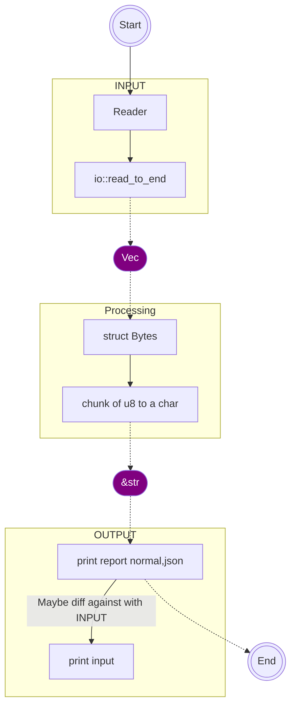

# ascii-cleaner


## Possible strategy

```graphwiz

digraph G {

  subgraph cluster_0 {
    // Subgraph parameters
    label = "INPUT";
    color = brown
    // node [shape=rectangle]
    
    // Inner Nodes parameters
    a0 [label="Reader"]
    a1 [label="io::read_to_end"]
    
    // Inner Edges parameters
    a0 -> a1[color=yellow];
    
  }
  
  subgraph cluster_1 {
    // Subgraph parameters
    label = "Processing";
    node [shape=rectangle]
    color=blue
    
    // Inner Nodes parameters
    b0 [label="struct Bytes"]
    b1 [label="chunk of u8 to a char"]
    
    // Inner Edges parameters
    b0 -> b1[color=yellow];
  }

  subgraph cluster_2 {
    // Subgraph parameters
    node [shape=rectangle]
    label = "OUTPUT";
    color=green
    
    // Inner Edges parameters
    c0 [label="print report (normal,json)"]
    c1 [label="print input"]
    // Inner Edges parameters
    c0 -> c1 [label="Maybe diff the against with INPUT"];
  }
  
  // Nodes
  start [shape=Mdiamond];
  a_to_b [label="Vec<u8>",shape=filled,color=purple]
  b_to_c [label="&str", shape=filled,color=purple ]
  end [shape=Msquare];
  
  // Inter-graph Edges
  start -> a0;
  a1 -> a_to_b[style=dashed];
  a_to_b -> b0[style=dashed];
  b1 -> b_to_c[style=dashed];
  b_to_c -> c0[style=dashed];
  c0 -> end[style=dashed];
}


```





## Running
```sh

$ ascii-cleaner
ASCII File Sanitizer

USAGE:
    ascii-cleaner <ACTION> <FILE> [OPTIONS]

ACTIONS:
    detect      Detect non-ASCII characters in file
    sanitize    Remove or replace non-ASCII characters

OPTIONS (for sanitize action):
    --no-backup         Don't create backup file
    --remove            Remove non-ASCII characters instead of replacing
    --no-replace        Don't replace non-ASCII characters (remove them)
    --replace=CHAR      Replace non-ASCII characters with CHAR (default: '?')

EXAMPLES:
    ascii-cleaner detect myfile.txt
    ascii-cleaner sanitize myfile.txt
    ascii-cleaner sanitize myfile.txt --replace=*
    ascii-cleaner sanitize myfile.txt --remove --no-backup

$ ascii-cleaner detect ./myfile.txt
File: ./myfile.txt
Mode: detect
Non-ASCII characters found:
  - Total non-ASCII characters: 1
  - Lines affected: 1

$ ascii-cleaner sanitize ./myfile.txt
File: ./myfile.txt
Mode: sanitize
Non-ASCII characters found:
  - Total non-ASCII characters: 1
  - Lines affected: 1
File has been sanitized

$ ascii-cleaner detect ./myfile.txt
File: ./myfile.txt
Mode: detect
File is already ASCII-clean

```
